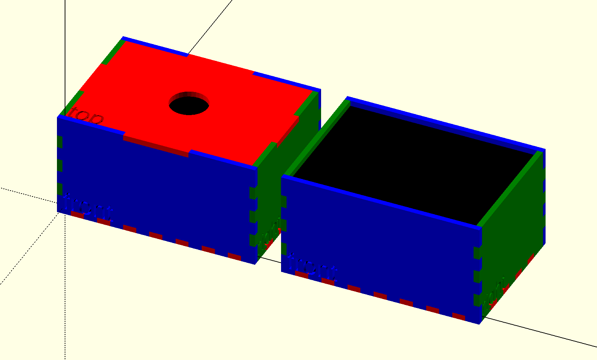
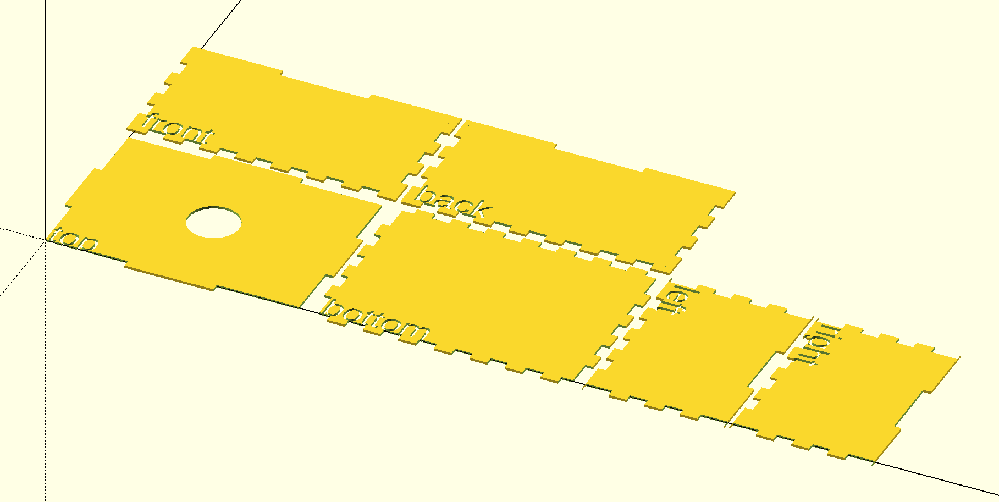

OpenSCAD Boxmaker
=================

A port of the classic laser cut finger joint boxmaker to OpenSCAD.

See `demo.scad` for a complete demo.

While this functions great as a one-off box generation tool, this is intended
to be used as a library. Each face can be modified and then rendered either
in the 2D cut layout or the 3D preview. All of the finger joints are
customizable and there's an easy way to create an easy-to-remove lid if
desired.

License
-------

This library is licensed under the [LGPL 2.1](http://www.gnu.org/licenses/lgpl-2.1.html).

OpenSCAD Boxmaker  
Copyright (C) 2017  Steve Pomeroy

This library is free software; you can redistribute it and/or
modify it under the terms of the GNU Lesser General Public
License as published by the Free Software Foundation; either
version 2.1 of the License, or (at your option) any later version.

This library is distributed in the hope that it will be useful,
but WITHOUT ANY WARRANTY; without even the implied warranty of
MERCHANTABILITY or FITNESS FOR A PARTICULAR PURPOSE.  See the GNU
Lesser General Public License for more details.

You should have received a copy of the GNU Lesser General Public
License along with this library; if not, write to the Free Software
Foundation, Inc., 51 Franklin Street, Fifth Floor, Boston, MA  02110-1301  USA
